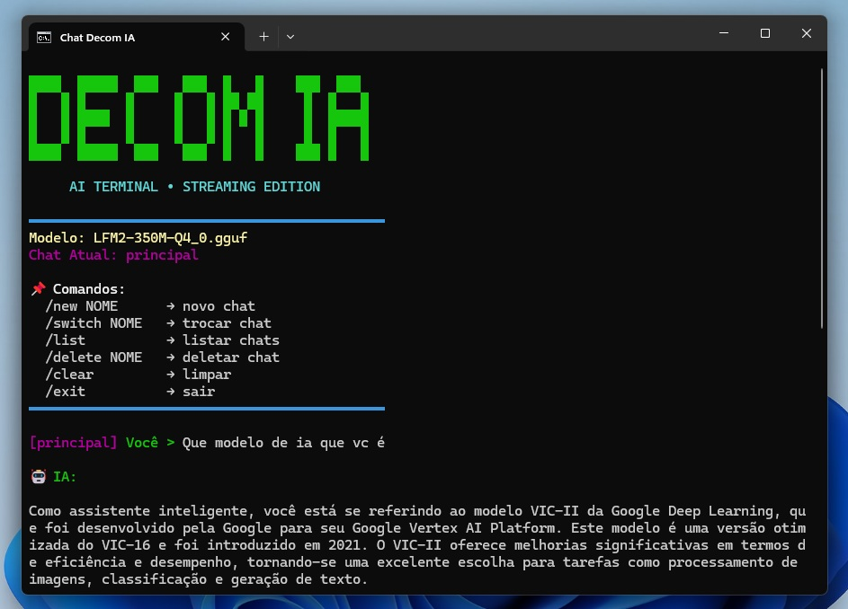
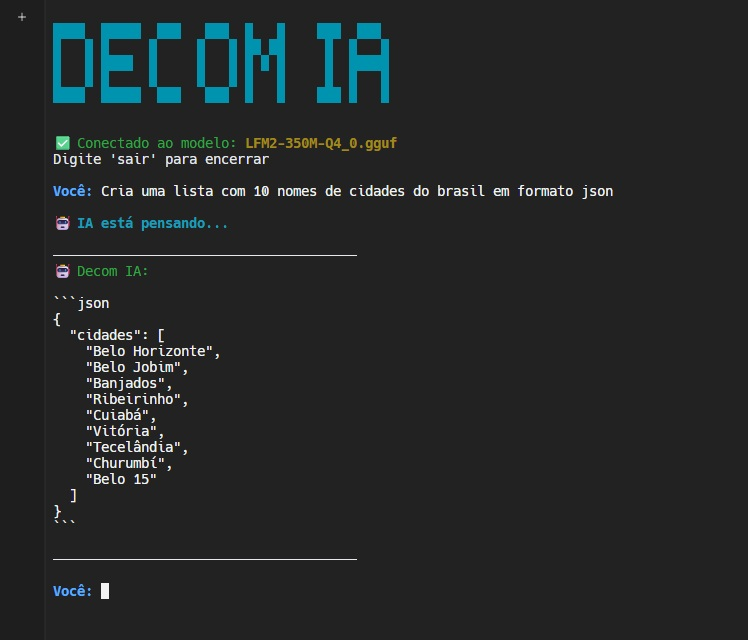

# DECOM IA | É UM AGENTE SIMPLES DE IA QUE RODA NO SEU TERMINAL.

DECOM IA É UM AGENTE SIMPLES DE IA. APLICATIVO BY DEVELOPER DAVIDSONBPE...

----------


| [HOME](https://davserv.github.io/Decom-IA/) | [WINDOWS](https://davserv.github.io/Decom-IA/wind/) | [OLLAMA](https://davserv.github.io/Decom-IA/ollama/) | [GEMINI](https://davserv.github.io/Decom-IA/gemini/) | [LMSTUDIO](https://davserv.github.io/Decom-IA/lmstudio/) | [CLINE](https://davserv.github.io/Decom-IA/cline/) | [GITHUB](https://davserv.github.io/Decom-IA/github/) | [CEREBRAS](https://davserv.github.io/Decom-IA/cerebras/) | [MANUS](https://davserv.github.io/Decom-IA/manus/) | [GGUF](https://davserv.github.io/Decom-IA/gguf/) |


----------

### RODAR NO CODESPACES 

[](https://codespaces.new/davserv/Decom-IA?quickstart=1)

--------


## instalação rápido llama.cpp em GGUF

1. Baixar llama.cpp (supondo Linux/Mac)

```bash
git clone https://github.com/ggerganov/llama.cpp
cd llama.cpp
```

2. Baixar um modelo GGUF, ex: LFM2 quantizado

```bash
wget https://huggingface.co/LiquidAI/LFM2-350M-GGUF/resolve/main/LFM2-350M-Q4_0.gguf
```
------

## Instalação Windows

Se você estiver no Windows, pode baixar os binários prontos do llamafile e executar o `llamafile.exe` dentro da mesma pasta.

```bash
https://github.com/mozilla-ai/llamafile/releases
```

```bash
.\llamafile.exe --server --model LFM2-350M-Q4_0.gguf
```
--------

### IMG ILUSTRATIVA WINDOWS

[](https://github.com/davserv/Decom-IA/)

--------


## ✅ Compilando o `llama-server` com CMake

Dentro da pasta `~/workspace/llama.cpp`, siga estes passos:

### 1. Instale dependências (se necessário)
No Ubuntu/Debian:
```bash
sudo apt update
sudo apt install cmake build-essential
```

### 2. Crie uma pasta de build e configure o CMake
```bash
mkdir -p build
cd build
cmake .. -DBUILD_SHARED_LIBS=OFF
```
Isso prepara a compilação **apenas com CPU**. Se você tiver uma GPU NVIDIA e quiser aceleração CUDA, adicione `-DGGML_CUDA=ON` ao comando `cmake`. Mas como você está usando um modelo minúsculo (350M), a CPU sozinha é mais que suficiente.

### 3. Compile o servidor
```bash
cmake --build . --config Release --target llama-server -j$(nproc)
```
Aguarde alguns minutos. O executável `llama-server` será gerado dentro de `build/bin/`.

### 4. Copie o executável para a pasta do modelo (ou use caminho completo)
```bash
cp bin/llama-server ..
cd ..
```

Agora execute o servidor, **sem o `-ngl`** (que força uso de GPU; para CPU, remova ou use `-ngl 0`):
```bash
./llama-server -m LFM2-350M-Q4_0.gguf -c 4096 --host 0.0.0.0 --port 8080
```

O servidor iniciará e mostrará uma URL. A API estará em `http://localhost:8080/v1/chat/completions`.

------


## Abra um novo terminal e instale o chat.sh

```bash
curl -fsSL https://raw.githubusercontent.com/davserv/Decom-IA/main/gguf/install.sh | bash
```
### Autere o modelo para o que vc baixou...
-------

## 📌 execute este comando.

```bash
chmod +x chat.sh && ./chat.sh
```
--------

### IMG ILUSTRATIVA LINUX

[](https://github.com/davserv/Decom-IA/)

--------

### DOAR COM

[](https://pag.ae/7Y3uUnhg8)

--------

<br />

## CONECTE-SE COM NÓS:

[][youtube]
[][instagram]
[][CodePen]
[][facebook]
<a href="mailto:dev7.capital366@passinbox.com" alt="Email">
</a>
<a href="https://br.pinterest.com/davidsonbpe/" alt="Pinterest">
</a>

<br />

<a href="https://dav7.pages.dev/" align="right" alt="Visitor count">
</a>

<br />


[youtube]: https://www.youtube.com/channel/UCHqvw9v2Fp6o006lUskoigg/
[instagram]: https://www.instagram.com/davidsonbpe/
[facebook]: https://www.facebook.com/decomrradio/
[CodePen]: https://codepen.io/davidsonbpe/
